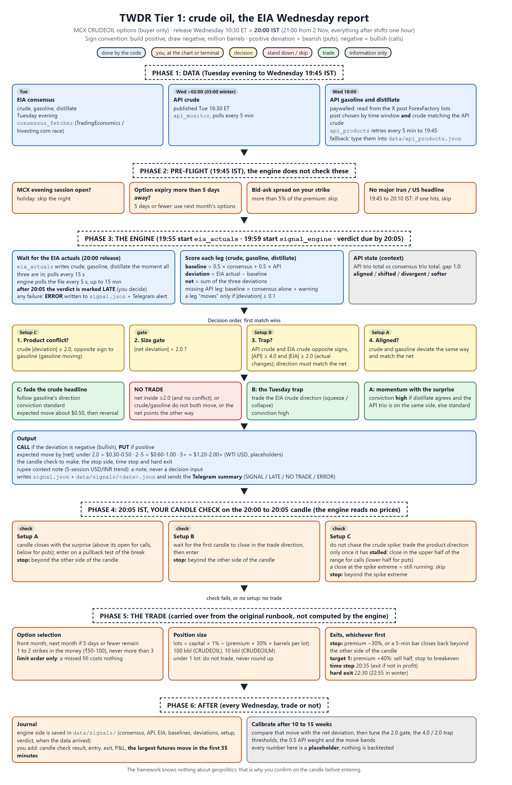
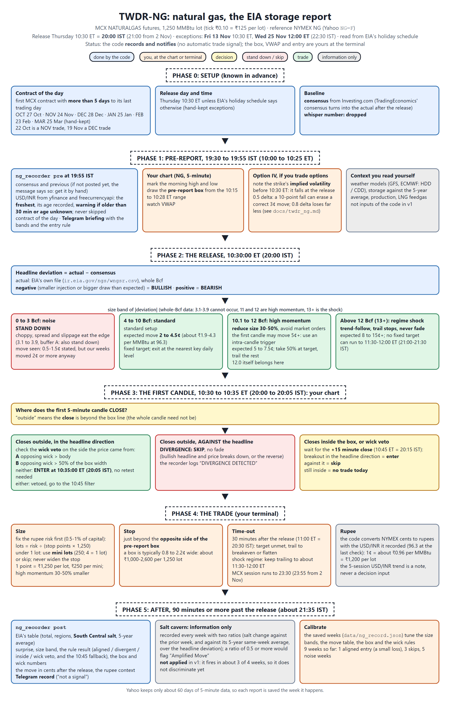
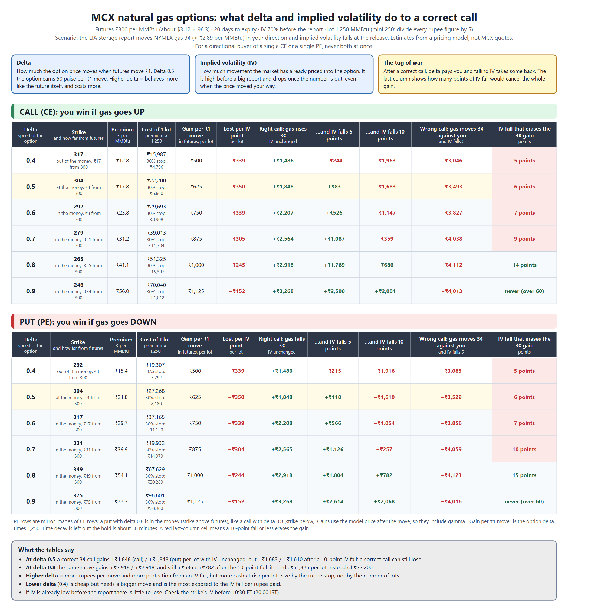

# TWDR Tier 1: EIA inventory surprise on MCX crude options

**Status.** Tier 1 (crude, gasoline, distillate) is built: `python -m app.signal_engine` produces the verdict
below. Tiers 2 to 4 (Cushing, refinery runs, SPR, imports, product supplied) are designed but not built; they
live in [docs/tiers_2_4.md](docs/tiers_2_4.md). Natural gas (TWDR-NG) records every weekly storage report and
sends a briefing and a record to Telegram, but gives no automatic trade signal yet: see
[docs/twdr_ng.md](docs/twdr_ng.md). The developer spec and decision log are in
[docs/signal_engine.md](docs/signal_engine.md). Every number below marked *placeholder* is a starting value,
not a backtested one.

**The idea.** On Wednesday at 20:00 IST the EIA prints crude, gasoline and distillate stock changes. The market
judges each against consensus *after* Tuesday's API print has already shifted expectations. So each stock gets
a baseline (consensus pulled toward the API), a deviation (EIA minus baseline), and the three deviations
together decide the setup: all three agreeing, crude disagreeing with the products, or a Tuesday trap the EIA
reverses. The engine delivers the verdict before 20:05; you confirm on the 20:00 to 20:05 candle and trade.

**Sign convention.** A build is positive and a draw is negative, in millions of barrels (M bbl). A positive
deviation is bearish (buy puts); a negative deviation is bullish (buy calls).

**Position type.** A directional option buyer: you buy either a single Call (CE) or a single Put (PE), never both at once.
No straddles or strangles, no writing options, no opposite-side hedge.

---

## Flowcharts

**Crude oil: the Wednesday EIA report** (sections 1 to 8 below, step by step)

**Natural gas: the Thursday EIA storage report** (record and notify; the rules and the evidence are in
[docs/twdr_ng.md](docs/twdr_ng.md))

**Natural gas options: what delta and implied volatility do to a correct call** (deltas 0.4 to 0.9, calls and
puts; sizing section of [docs/twdr_ng.md](docs/twdr_ng.md))

Blue boxes are done by the code, orange ones are you at the chart or the terminal. The two flowcharts are drawn by
`python docs/img/make_flowcharts.py` and the option tables by `python docs/img/make_iv_tables.py`; when a rule
changes in this README or in `docs/twdr_ng.md`, change it in that script and rerun it.

---

## 1. Data points

| Data | Unit | When (IST, summer time) | Source |
|---|---|---|---|
| EIA consensus: crude, gasoline, distillate | M bbl | Tue evening | `consensus_fetcher` (TradingEconomics / Investing.com) |
| API crude change | M bbl | Wed ~02:00 (03:00 in winter) | `api_monitor` |
| API gasoline and distillate change | M bbl | posted ~02:00; collected Wed 18:00 | `api_products`: the X post that ForexFactory lists. Fallback: type them into `data/api_products.json` |
| EIA crude, gasoline, distillate change | M bbl | 20:00 | `eia_actuals` |
| Release candle (open, high, low, close) | price | 20:00 to 20:05 | Your chart (the engine never reads prices) |
| MCX futures price, expiry, strike, premium, bid, ask, capital | ₹ | 19:45 to 20:05 | Broker (only for the option trade) |

Collected for later tiers but unused by Tier 1: EIA Cushing change and level, net imports, refinery utilization
change, API Cushing and SPR (recorded in `eia_actuals.json`, `api_products.json` and `signal.json`).

## 2. Timeline (IST, US summer time)

| Time | What |
|---|---|
| Tue evening | Consensus fetched |
| Wed 18:00 | `python -m app.api_products` collects API gasoline and distillate (retries every 5 min to 19:45) |
| 19:45 | Pre-flight checks (section 5) |
| 19:55 | Start `python -m app.eia_actuals` |
| 19:59 | Start `python -m app.signal_engine` (it waits for the EIA numbers) |
| 20:00 | EIA release |
| by 20:05 | Engine verdict: `SIGNAL`, `NO TRADE`, or `LATE` if it arrived after 20:05 (you decide) |
| 20:05 | Your candle check, then entry |
| 20:35 | Time stop |
| 22:30 | Hard exit, everything closed |

**From 2 November** (US winter time) the release is 21:00 and everything after it shifts one hour: verdict by
21:05, time stop 21:35, hard exit 22:55 (MCX closes 23:55).

---

## 3. The score

**Step 1: baseline and deviation, per stock.** For crude, gasoline and distillate:

- Baseline = 0.5 × consensus + 0.5 × API
- Deviation = EIA actual − baseline
- Net deviation = crude + gasoline + distillate deviations

If an API leg is missing, that stock's baseline is the consensus alone and the engine warns. A stock counts as
moving only if its deviation is at least 0.1 M bbl in size (*placeholder*).

**Step 2: API state (context, Tuesday).** Compare the API trio total with the consensus trio total; the gap is
API minus consensus.

| State | Condition (gap threshold 1.0 M bbl, *placeholder*) |
|---|---|
| aligned | gap under 1.0: the API changed little |
| shifted | gap at least 1.0, API further out than consensus on the same side: expectations moved |
| divergent | API and consensus on opposite sides: the baseline is broken |
| softer | same side as consensus but weaker (a label of ours, not in the sources) |

**Step 3: setup, checked in this order.**

| # | Setup | Condition | Trade |
|---|---|---|---|
| 1 | **C: product conflict** | Crude deviation is at least 2.0 in size and its sign is opposite to gasoline's (gasoline moving) | Fade the crude headline, follow gasoline's direction |
| 2 | *size gate* | \|net deviation\| under 2.0 (*placeholder*) | **NO TRADE** |
| 3 | **B: trap** | API crude and EIA crude have opposite signs, \|API crude\| at least 4.0 and \|EIA crude\| at least 2.0 (actual changes, *placeholder*) | Trade the EIA's direction (a squeeze or a collapse) |
| 4 | **A: aligned** | Crude and gasoline deviations both moving the same way, matching the net | Momentum with the surprise |
| 5 | none of the above | | **NO TRADE** |

Setup C is checked before the size gate on purpose: a crude draw of 4 against product builds nets to almost
nothing, which is exactly the conflict to catch. Direction in B and A also has to agree with the sign of the net
deviation, otherwise it is NO TRADE.

**Conviction.** A is *high* if distillate also deviates the same way and the API trio sits on that side,
*standard* otherwise. B is *high*. C is *standard*.

**Step 4: expected move** (WTI, USD per barrel, first ~30 minutes; *placeholder* bands):

| \|Net deviation\| | Expected move |
|---|---|
| under 2.0 M | 0.30 to 0.50 |
| 2.0 to 5.0 M | 0.60 to 1.00 |
| 5.0 M and over | 1.20 to 2.00+ |
| Setup C (any size) | about 0.50, then reversal |

As a cross-check the engine also prints 0.15 to 0.25 per 1 M of net deviation. These are WTI dollars, not MCX
rupees; premium moves depend on delta and implied volatility.

---

## 4. At 20:05: your candle check

The engine reads no prices. Its message says what to check on the 20:00 to 20:05 candle:

| Setup | Check | Stop reference |
|---|---|---|
| **A** | Candle closes with the surprise (above its open for calls, below for puts); enter on a pullback test of the break | Beyond the other side of the candle |
| **B** | Wait for the first candle to close in the trade direction, then enter | Beyond the other side of the candle |
| **C** | Do not chase the crude spike. Trade the product direction only once the spike has stalled: the candle closes in the upper half of its range for calls (lower half for puts). A close at the spike extreme means it is still running: skip | Beyond the spike extreme |

If the check fails, no trade. The half-range rule for C is our reading of "wait for the spike to stall" and is
yours to tune.

## 5. Pre-flight checks (19:45)

Skip the night if any of these fail (the engine does not check them):
- MCX's evening session is closed (holiday).
- Option expiry is 5 days away or fewer: use the next month's options.
- The bid-ask spread on your strike is more than 5% of the premium.
- Major Iran or US headline news hits between 19:45 and 20:10.

## 6. Option selection

Carried over from the original runbook; the engine does not compute it.

| Rule | Value |
|---|---|
| Expiry | Front month, unless 5 days or fewer remain; then the next month |
| Strike | 1 to 2 strikes in the money (₹50 to 100). Never more than 3 |
| Order | Limit order only. A missed fill costs nothing |

For a put, in the money means a strike above the futures price. For a call, a strike below it.

## 7. Risk and exits

Carried over from the original runbook; the engine does not compute it. `data/thresholds.json` no longer
carries any option or sizing numbers, so these rules live only here until that part is built.

**Position size.** Lots = (Capital × 1%) ÷ (Premium × 30% × barrels per lot). Barrels per lot: 100 for
CRUDEOIL, 10 for CRUDEOILM. Premium ₹320 gives a stop of ₹96: on CRUDEOIL that is ₹9,600 per lot, so ₹10 lakh
at 1% gives 1 lot; on CRUDEOILM it is ₹960, so 10 lots. If the result is under 1 lot, do not trade; do not round
up.

**Exits (whichever comes first).**

| Exit | Rule |
|---|---|
| Stop | Premium falls 30%, or a 5-minute bar closes back beyond the other side of the candle |
| Target 1 | Premium +40%: sell half, move the stop to breakeven |
| Time stop | 20:35. If not in profit, exit |
| Hard exit | 22:30. Everything closed |

## 8. Journal (after every Wednesday, trade or not)

`data/signals/<release date>.json` already keeps the engine's side: consensus, API, EIA, baselines, deviations,
setup, verdict, and when the data arrived. Add your side: the candle check result, entry, exit, P&L, and **the
largest futures move in the first 35 minutes**.

That last number is how you calibrate. After 10 to 15 weeks compare it with the net deviation: if deviations
around 2.0 reliably move futures far more than the table says, lower the 2.0 gate; if 5.0 and over often goes
nowhere, raise it. The same applies to the 4.0 and 2.0 trap thresholds and the 0.5 API weight.

---

## 9. Worked examples

**A real week: 22 to 23 September** (API posted 22 Sep, EIA 23 Sep; market flat afterwards).

| | Consensus | API | Baseline | EIA actual | Deviation |
|---|---|---|---|---|---|
| Crude | −0.600 | +1.786 | +0.593 | +2.969 | **+2.376** |
| Gasoline | +0.100 | −2.160 | −1.030 | −1.686 | **−0.656** |
| Distillate | −0.600 | −2.164 | −1.382 | −0.428 | **+0.954** |

Net deviation +2.67; API trio −2.54 against consensus trio −1.10, gap −1.44: *shifted*. Crude (+2.38) opposes
gasoline (−0.66) and crude is over 2.0, so **Setup C**: fade the crude build, follow gasoline: bullish, calls,
expected move about $0.50, standard conviction. The crude-build/product-draw mirror of Setup C is not in the
sources and is treated symmetrically here; this week is a reminder that it is untested.

**Illustrative (invented numbers), aligned.** Consensus crude −1.0, gasoline +0.5, distillate −0.5; API the same.
EIA −3.0, −0.5, −1.0: deviations −2.0, −1.0, −0.5, net −3.5. All three agree: **Setup A**, calls, *high*
conviction (distillate agrees and the API trio is on the same side), expected move $0.60 to $1.00.

**Illustrative (invented numbers), trap.** Consensus crude 0, API crude +4.5, EIA crude −2.5. Baseline +2.25,
deviation −4.75. API and EIA oppose, 4.5 ≥ 4.0 and 2.5 ≥ 2.0: **Setup B**, calls, *high* conviction, expected
move $0.60 to $1.00.

---

**Known limits.**
- Every threshold is a placeholder (0.5 API weight, 0.1, 2.0, 1.0, 4.0 and the move bands); nothing is
  backtested. The journal turns them into your numbers.
- API gasoline and distillate come from one tweet on one page, checked only by matching API crude; read the
  quoted post that `api_products` logs.
- The data sites lag at 20:00. If the numbers arrive after 20:05 the verdict is marked `LATE`.
- Unconfirmed readings: the trap's EIA threshold uses the actual change; a conflict means crude against
  gasoline only (distillate only sets conviction); the mirror of Setup C is symmetric.
- The framework knows nothing about geopolitics. That is why you confirm on the candle before entering.

**Where things are.** [docs/signal_engine.md](docs/signal_engine.md) (spec, decisions, the `api_products.json`
schema), [docs/tiers_2_4.md](docs/tiers_2_4.md) (Cushing, refinery, SPR, imports, product supplied, and the
original Lite vetoes), [docs/twdr_ng.md](docs/twdr_ng.md) (natural gas: inputs, rulings, tests on the recorded
weeks), `docs/img/` (the two flowcharts and the script that draws them), [docs/twdr_learning_resources.md](docs/twdr_learning_resources.md) (reading list),
`CLAUDE.md` (developer notes).
